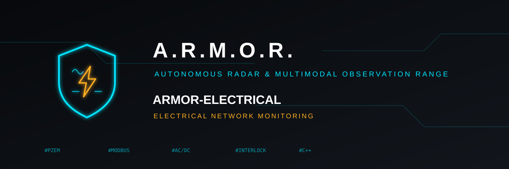

<p align="center">
  
</p>

# ⚡ ARMOR-ELECTRICAL

<p align="center">
  🇺🇸 <b>English</b> |
  <a href="README_spa.md">🇪🇸 Español</a> |
  <a href="README_fra.md">🇫🇷 Français</a> |
  <a href="README_ita.md">🇮🇹 Italiano</a> |
  <a href="README_deu.md">🇩🇪 Deutsch</a> |
  <a href="README_zho.md">🇨🇳 简体中文</a> |
  <a href="README_jpn.md">🇯🇵 日本語</a>
</p>

### Electrical node: reads the voltages, currents, power and energy of the house's AC and DC network and holds the rules for switching it (host-tested core and a firmware that builds; it has never run on a board)

<p align="center">
  
  
  
  
  
</p>

---

**Honesty check - what runs today:** **Maturity: scaffolding.** The core (the frames of the PZEM-004T v3 and PZEM-017 meters, the bus that asks them, the message of the node and the rules for switching: 53 checks of the meters and 135,736 of the switching rules) is tested on a computer with stand-in meters and contactors, and the messages it makes are accepted by ARMOR-COMMON. The firmware of the node (the settings, the serial line and the Meters and Readings pages of its panel: 71 more checks) builds in the ESP-IDF 5.4.2 container for both boards. **It has never run on a board, nothing has been connected to a meter or a contactor, and nothing here switches anything.**

---

## 🎯 Overview

* **Reading the meters:** the Modbus RTU frames of the Peacefair **PZEM-004T v3** (AC) and **PZEM-017** (DC): the CRC, the request that reads the registers and the decoding of the reply (voltage, current, power, energy, frequency, power factor, alarm). Only the read request is built: the ones that write to a meter (its address, its thresholds, the reset of its energy) are not built anywhere. A reply that does not fit, or holds a value no real meter could give, is refused.
* **The bus:** a line with several meters is asked one at a time, with a timeout; the last good reading of each is kept and a meter that goes silent stops being published after ten seconds.
* **The message** `armor/electrical/<node>/state`: one entry per channel (a circuit, a line, the grid input, a DC bus) with AC or DC, voltage, current, power, energy, frequency, power factor, the state of a switch as the node sees it and an alarm; it is in the shared contract and carries a state, never a command.
* **The rules for switching,** apart from any hardware: a controller for the transfer between two sources that never commands both, needs the switching allowed, the node armed just before, both contactors confirmed open for the whole dead time, and turns a contactor that does not show what it was told into a fault that stays until it is acknowledged. **Switching is off by default and nothing drives any hardware.**
* **Where it shows:** the *Electrical Designer* of ARMOR-STUDIO draws the house's network and shows on each element what its channel measures; ARMOR-SERVER keeps the readings, their history and the sums.
* **The firmware of the node** (ESP32-S3-WROOM-1 N16R8 on Wi-Fi, or the Waveshare ESP32-S3-ETH on its cable): the settings, one serial line for up to sixteen meters and the web panel of the other nodes (set-up, users, Wi-Fi, broker, update over the air, HTTPS) with its own Meters and Readings pages, in seven languages. It only reads: the rules for switching are not linked into it. See [the firmware](docs/NODE_FIRMWARE.md).
* **Not yet:** the firmware running on a board, the hardware, any measurement of a real installation and any switching.

## 📂 Repository Structure

```text
ARMOR-ELECTRICAL/
├── core/    pzem.hpp (frames of the PZEM meters), pzem_bus.hpp (the line), electrical_json.hpp (the message), interlock.hpp (the rules for switching), json.hpp
├── tests/   test_meters.cpp, test_interlock.cpp, emit_samples.cpp + check_samples.py (the messages against ARMOR-COMMON)
├── docs/    DESIGN, SAFETY, SWITCHING, PROTOCOLS, ELECTRICAL_MESSAGES, HARDWARE
└── images/  brand assets
```

## 🛠️ Development Environment

```bash
cmake -S tests -B build/host && cmake --build build/host && ctest --test-dir build/host   # the meters (53 checks) and the switching rules (135,736)
build/host/emit_samples | python tests/check_samples.py                                     # the messages, against ARMOR-COMMON
```

See the [design](docs/DESIGN.md), the [safety notes](docs/SAFETY.md), the [rules for switching](docs/SWITCHING.md), the [protocols](docs/PROTOCOLS.md) and the [messages](docs/ELECTRICAL_MESSAGES.md).

## 🔗 Related Projects

**A.R.M.O.R.** (Autonomous Radar & Multimodal Observation Range) is a perimeter-security system made of independent repositories. Each one has its own version, its own tests and its own README; this is the family:

* **[ARMOR-COMMON](../ARMOR-COMMON)** - Message contracts, validators, conformance vectors and generated types
* **[ARMOR-RADAR](../ARMOR-RADAR)** - Field-node firmware for ESP32-S3 with three radars and its own web panel
* **[ARMOR-SOLAR](../ARMOR-SOLAR)** - Solar inverter and battery protocols and the messages of a gateway node
* **ARMOR-ELECTRICAL** (this repository) - Electrical node: meters, the message of the network's readings and the rules for switching
* **[ARMOR-SERVER](../ARMOR-SERVER)** - Central coordinator: telemetry, alarms, devices, solar readings and cameras
* **[ARMOR-STUDIO](../ARMOR-STUDIO)** - Web console: cameras, radar, alarms, solar energy and the 2D/3D site designer
* **[ARMOR-ANDROID-CONTROL](../ARMOR-ANDROID-CONTROL)** - Android operator client with a live 2D/3D radar
* **[ARMOR-SERVER-AI](../ARMOR-SERVER-AI)** - Visual inference policy that explains its decisions and never actuates
* **[ARMOR-VOICE-AI](../ARMOR-VOICE-AI)** - Offline voice intents with a confirmation that cannot be forged
* **[ARMOR-HARDWARE](../ARMOR-HARDWARE)** - Enclosures, electronics and the bench acceptance matrix
* **[ARMOR-DEVOPS](../ARMOR-DEVOPS)** - Deployment, the CM5 test bench, backup and TLS
* **[ARMOR-SIMULATOR](../ARMOR-SIMULATOR)** - Offline telemetry simulator with repeatable faults
* **[ARMOR-DOCS](../ARMOR-DOCS)** - Architecture, security baseline and the capability matrix

## 📚 Documentation & Community

Where to read more:

* [Capability matrix: what is proven and what is not](../ARMOR-DOCS/docs/CAPABILITY_MATRIX.md)
* [Project catalogue: versions and how the repositories depend on each other](../ARMOR-DOCS/docs/PROJECT_CATALOG.md)
* [Changelog of this repository](CHANGELOG.md)
* [License (GPL-3.0-or-later)](LICENSE)
* Questions, ideas and reports: electrohobby3d@gmail.com

## 👤 AUTHOR

**JuanenRac (Electro Hobby 3D)** · electrohobby3d@gmail.com

## 📜 LICENSE

GPL-3.0-or-later - see [LICENSE](LICENSE).
